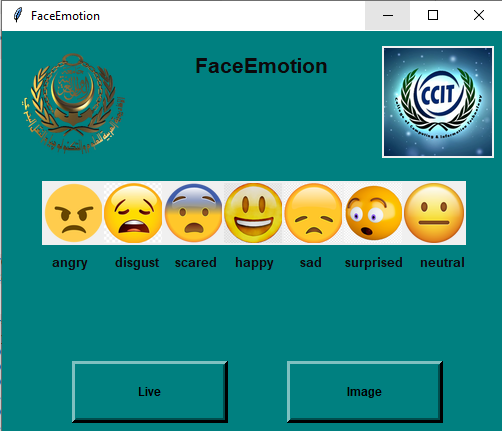
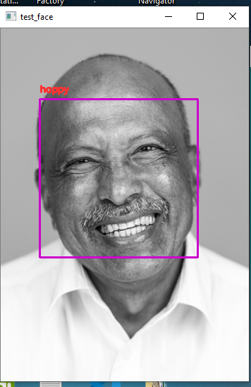
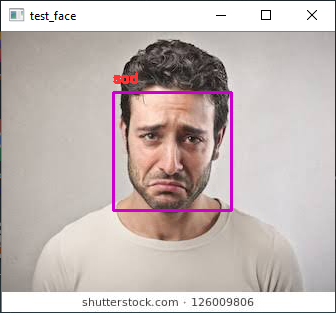
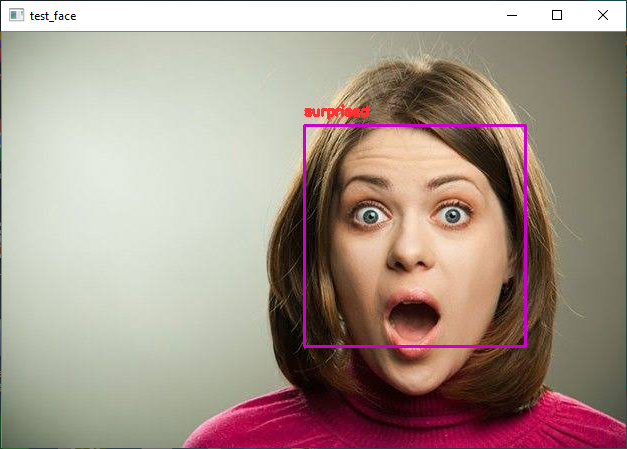
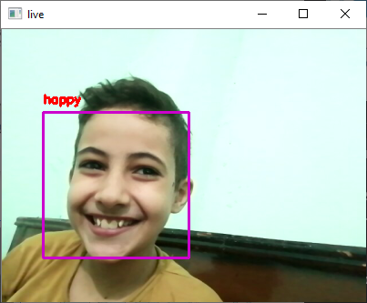

# My Graduation project.

## Emotion-recognition-using-facial-expressions:
## Welcome! 👋
This project uses a conventional neural network ,functional model  and residual modules to detect human face and classify face emotion .
### All information in presentation in Book Presentation folder.

## Some Results:

